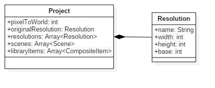
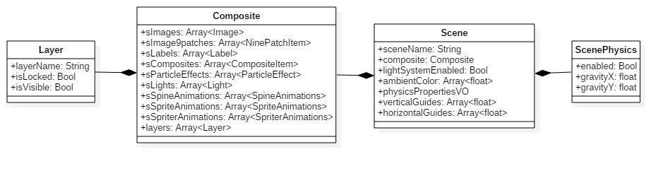
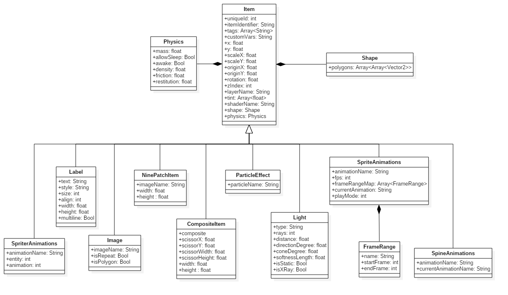

# Overlap2dDataStructure
Provide a generic data structure to load the Json files exported by the [Overlap2d](http://overlap2d.com/) editor in a [Libgdx](https://libgdx.badlogicgames.com/) project.

#Project setup
The main objective of this project is to load a scene produced with the Overlap 2D editor for a Libgdx game. In this way, if you want to use this project with an existing Ligdx game, you just have to perform the following steps:

* Download or clone the repo and rename it: ***overlap2dstructure***
* Put the repo to the root of your Libgdx project (next to the core, desktop, html, etc. forlders)
* Open the ***settings.gradle*** file of your Libgdx project and add the string: ***'overlap2dstructure'***. The file content should look like the following example: 
```gradle
include 'desktop', 'html', 'core', 'overlap2dstructure'
```
The content may vary depending on the type of Libgdx game that you are producing. In the previous example, I don't have any references to the mobile platforms projects that you may have.

* Add a compile depency on ***overlap2dstructure*** in the ***core*** project dependencies of your game. Example: 

```gradle
project(":core") {
    apply plugin: "java"

    dependencies {
        compile project(":overlap2dstructure")
        compile "com.badlogicgames.gdx:gdx:$gdxVersion"
    }
}
```

#How to use it
The following examples are given in the context of a Libgdx project. The [Json](https://github.com/libgdx/libgdx/wiki/Reading-&-writing-JSON) class and [Gdx.files.local](https://github.com/libgdx/libgdx/wiki/File-handling) method are part of the Libgdx framework.

## Load an Overlap2d project
If you want to load a ***Project*** data structure from a Json string exported by the Overlap2d editor, use the following lines:
```java
Json json = new Json();
Project project = json.fromJson(Project.class, Gdx.files.local(
	"project.dt"
	));
```
Of course, the path given in the example needs to be changed to match your needs. 

## Load an Overlap2d scene
If you want to load a ***Scene*** data structure from a Json string exported by the Overlap2d editor, use this:
```java
Json json = new Json();
        Scene scene = json.fromJson(Scene.class, Gdx.files.local(
                "scenes/MainMenuScreen.dt"
        ));
```
Same for the path here, it needs to be changed to suit your needs.

#Data structures
This sections gives the details about the data structures you can load thanks to this project.

##Project
Whenever it is exported, an Overlap2d project always produces a ***project.dt*** Json file in the ***export*** folder of the project. This one, as indicated by its name, contains information about your project. Once loaded, these data are accessible through the following structure:



##Scene
Each Overlap2d project contains at least one Scene. A scene basically represents a screen of your game. When you export a project from the editor, the data of your scenes are written in several Json files in a folder named ***scenes***. Once you have loaded a scene, thanks to the previous method, these data are accessible through the following data structure:



##Items
Finally, each scenes contains a set of items (Image, NinePatch, Label, etc.). Theses items are represented by the following class hierarchy:


